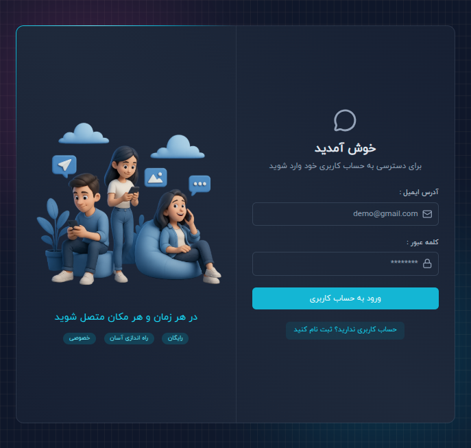
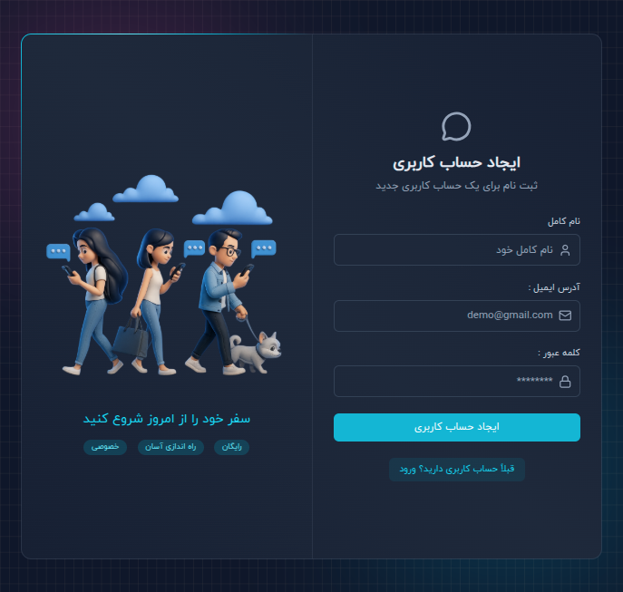
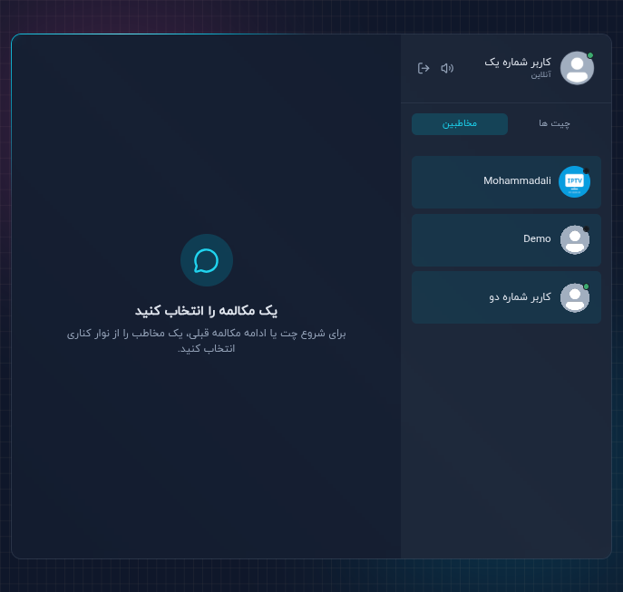
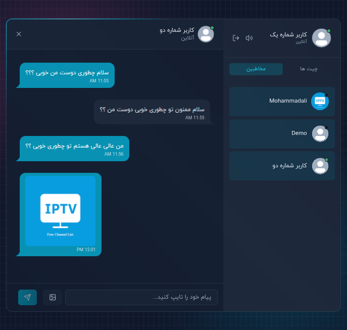

<h1 align="center">✨ MERN Chatify ✨</h1>

<h3>Highlights :</h3>

<ul>
    <li>🔐 Custom JWT Authentication (no 3rd-party auth)</li>
    <li>⚡ Real-time Messaging via Socket.io</li>
    <li>🟢 Online/Offline Presence Indicators</li>
    <li>🔔 Notification & Typing Sounds (with toggle)</li>
    <li>📨 Welcome Emails on Signup (Resend)</li>
    <li>🗂️ Image Uploads (Cloudinary)</li>
    <li>🧰 REST API with Node.js & Express</li>
    <li>🧱 MongoDB for Data Persistence</li>
    <li>🚦 API Rate-Limiting powered by Arcjet</li>
    <li>🎨 Beautiful UI with React, Tailwind CSS & DaisyUI</li>
    <li>🧠 Zustand for State Management</li>
</ul>


## 🧪 .env Setup

### Backend (`/backend`)

```bash
PORT=PORT
MONGO_URI=mongo_uri

NODE_ENV=development

JWT_SECRET=jwt_secret

RESEND_API_KEY=resend_api_key
EMAIL_FROM=email_from_address
EMAIL_FROM_NAME=email_from_name

CLIENT_URL=http://localhost:5173

CLOUDINARY_CLOUD_NAME=cloudinary_cloud_name
CLOUDINARY_API_KEY=cloudinary_api_key
CLOUDINARY_API_SECRET=cloudinary_api_secret

ARCJET_KEY=arcjet_key
ARCJET_ENV=development
```

---

## 🔧 Run the Backend

```bash
cd backend
npm install
npm run dev
```

## 💻 Run the Frontend

```bash
cd frontend
npm install
npm run dev
```

## 🌅 Preview Images

<table width='100%'>
  <tr>
    <th>SIGNIN</th>
    <th>SIGNUP</th>
  </tr>
  <tr width='100%'>
    <td width='50%'>
        
    </td>
    <td width='50%'>
        
    </td>
  </tr>
</table>

<table width='100%'>
  <tr>
    <th>Chat Empty</th>
    <th>Chat</th>
  </tr>
  <tr width='100%'>
    <td width='50%'>
        
    </td>
    <td width='50%'>
        
    </td>
  </tr>
</table>